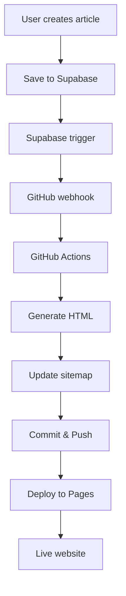

# 🚀 HƯỚNG DẪN SETUP AUTO-DEPLOY GITHUB PAGES

## 🎯 **TỔNG QUAN HỆ THỐNG**

Sau khi setup xong, luồng hoạt động sẽ như sau:

```
1. Người dùng tạo bài viết trong Admin Panel
2. Bấm "☁️ Lưu vào DB + Auto Deploy"
3. Dữ liệu được lưu vào Supabase
4. Supabase tự động trigger GitHub workflow
5. GitHub Actions tạo file HTML từ template + dữ liệu
6. File HTML được commit và deploy lên GitHub Pages
7. Website live ngay lập tức!
```

## 📋 **CHECKLIST SETUP**

### ✅ **1. GITHUB REPOSITORY SETUP**

#### **1.1 Enable GitHub Pages**

1. Vào repository: `https://github.com/Liam-and-Son-Group/baoviet-danang`
2. Settings → Pages
3. Source: `Deploy from a branch`
4. Branch: `gh-pages` (sẽ được tạo tự động)

#### **1.2 Create GitHub Personal Access Token**

1. GitHub → Settings → Developer settings → Personal access tokens → Tokens (classic)
2. Generate new token với permissions:
   - `repo` (Full control of private repositories)
   - `workflow` (Update GitHub Action workflows)
3. **SAVE TOKEN** - bạn sẽ cần paste vào Supabase

#### **1.3 Repository Secrets** (Nếu cần)

Nếu repository private, vào Settings → Secrets and variables → Actions:

- `SUPABASE_URL`: URL của Supabase project
- `SUPABASE_ANON_KEY`: Anon key của Supabase

### ✅ **2. SUPABASE SETUP**

#### **2.1 Setup GitHub Token trong Vault**

1. Vào Supabase Dashboard → Project Settings → Vault
2. Click "New secret"
3. Name: `github_token`
4. Value: Paste GitHub Personal Access Token từ bước 1.2
5. Save

#### **2.2 Enable HTTP Extension**

1. Vào Dashboard → Extensions
2. Tìm và enable "HTTP" extension
3. Confirm enable

#### **2.3 Run Database Migration**

Execute SQL file `supabase-auto-deploy.sql`:

```sql
-- Copy nội dung file supabase-auto-deploy.sql và chạy trong SQL Editor
```

#### **2.4 Test Database Functions**

Chạy test command:

```sql
-- Test manual deploy function
SELECT manual_deploy_article((SELECT id FROM articles LIMIT 1));

-- Check logs
SELECT * FROM webhook_logs ORDER BY created_at DESC LIMIT 5;
```

### ✅ **3. TEMPLATE FILES SETUP**

Kiểm tra các file template đã có:

- ✅ `templates/news/article.html`
- ✅ `templates/partials/header.html`
- ✅ `templates/partials/footer.html`
- ✅ `templates/partials/floating-buttons.html`
- ✅ `news-template-engine.js`

### ✅ **4. GITHUB ACTIONS SETUP**

Files đã được tạo:

- ✅ `.github/workflows/deploy-new-article.yml`
- ✅ `.github/scripts/generate-article.js`
- ✅ `.github/scripts/update-sitemap.js`

### ✅ **5. ADMIN INTERFACE SETUP**

Đã cập nhật:

- ✅ Auto-deploy sau khi lưu thành công
- ✅ Nút "🚀 Deploy GitHub Pages" để deploy thủ công
- ✅ Nút "📊 Kiểm tra Deploy Status" để xem logs

---

## 🧪 **TESTING & VERIFICATION**

### **Test 1: Manual Deploy**

1. Mở Admin Panel
2. Tạo một bài viết test
3. Bấm "☁️ Lưu vào DB + Auto Deploy"
4. Kiểm tra GitHub Actions: `https://github.com/Liam-and-Son-Group/baoviet-danang/actions`

### **Test 2: Check Deploy Logs**

1. Bấm "📊 Kiểm tra Deploy Status"
2. Xem logs trong console

### **Test 3: Manual Deploy**

1. Với bài viết đã có, bấm "🚀 Deploy GitHub Pages"
2. Kiểm tra GitHub Actions

### **Test 4: Verify HTML Output**

1. Sau khi deploy xong, kiểm tra file được tạo trong repository
2. Truy cập URL: `https://liam-and-son-group.github.io/baoviet-danang/[filename].html`

---

## 🔧 **TROUBLESHOOTING**

### **❌ GitHub Token Error**

```
Error: authentication failed
```

**Fix:** Kiểm tra GitHub token trong Supabase Vault có đúng không

### **❌ HTTP Extension Error**

```
Error: function http() does not exist
```

**Fix:** Enable HTTP extension trong Supabase Dashboard

### **❌ Template Not Found**

```
Error: Could not load template
```

**Fix:** Kiểm tra file template có tồn tại trong repository không

### **❌ GitHub Actions Fails**

1. Vào GitHub Actions tab
2. Click vào failed workflow
3. Xem error logs
4. Common issues:
   - Supabase credentials sai
   - Template file missing
   - Permission denied

### **❌ Deploy Success but Page Not Found**

1. Kiểm tra GitHub Pages settings
2. Đảm bảo branch `gh-pages` được chọn
3. Wait 5-10 phút để GitHub Pages update

---

## 📊 **MONITORING & MAINTENANCE**

### **Check Deploy History**

```sql
SELECT
  event_type,
  (payload->>'client_payload'->>'article_filename') as filename,
  status,
  created_at
FROM webhook_logs
ORDER BY created_at DESC
LIMIT 10;
```

### **Disable Auto-Deploy Temporarily**

```sql
ALTER TABLE articles DISABLE TRIGGER auto_deploy_article_trigger;
```

### **Re-enable Auto-Deploy**

```sql
ALTER TABLE articles ENABLE TRIGGER auto_deploy_article_trigger;
```

### **Manual Re-deploy All Articles**

```sql
SELECT manual_deploy_article(id) FROM articles WHERE is_published = true;
```

---

## 🎉 **SUCCESS INDICATORS**

Khi setup thành công, bạn sẽ thấy:

1. ✅ **Admin Panel**: Hiển thị "🎉 GitHub deploy đã được khởi động!"
2. ✅ **GitHub Actions**: Workflow "Deploy New Article" chạy thành công
3. ✅ **Repository**: File HTML mới được tạo trong root folder
4. ✅ **GitHub Pages**: Website live tại URL project
5. ✅ **Sitemap**: Được cập nhật tự động với URL mới

---

## 🔄 **WORKFLOW SUMMARY**



**🎯 Kết quả cuối cùng:** Tự động hóa hoàn toàn từ việc tạo bài viết đến website live!
