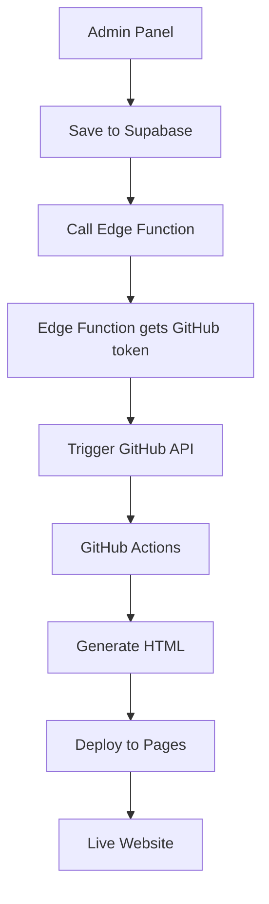

# 🚀 SETUP HƯỚNG DẪN: SUPABASE EDGE FUNCTION AUTO-DEPLOY

## 🎯 **GIẢI PHÁP BẢO MẬT**

Thay vì lưu GitHub token ở client-side, chúng ta sử dụng Supabase Edge Functions để:

- ✅ Lưu GitHub token an toàn ở server-side
- ✅ Client chỉ cần gọi Edge Function
- ✅ Không expose sensitive credentials

## 📋 **STEPS SETUP**

### **1️⃣ DEPLOY SUPABASE EDGE FUNCTION**

```bash
# Install Supabase CLI (nếu chưa có)
npm install -g supabase

# Login to Supabase
supabase login

# Link to your project
supabase link --project-ref YOUR_PROJECT_REF

# Deploy Edge Function
supabase functions deploy deploy-article

# Set environment variables
supabase secrets set GITHUB_TOKEN=ghp_your_github_token_here
```

### **2️⃣ RUN DATABASE MIGRATION**

Chạy SQL trong Supabase Dashboard → SQL Editor:

```sql
-- Copy nội dung từ supabase-auto-deploy.sql
-- Chỉ cần functions để log, không cần HTTP calls
```

### **3️⃣ GITHUB REPOSITORY SETUP**

1. **Create GitHub Personal Access Token:**

   - Vào: https://github.com/settings/tokens
   - Generate new token (classic)
   - Permissions: `repo`, `workflow`
   - Copy token

2. **Enable GitHub Pages:**
   - Repository → Settings → Pages
   - Source: Deploy from a branch
   - Branch: `gh-pages` (will be created automatically)

### **4️⃣ TEST DEPLOYMENT**

1. Mở Admin Panel
2. Tạo bài viết test
3. Bấm "☁️ Lưu vào DB + Auto Deploy"
4. Check console logs
5. Verify GitHub Actions: `https://github.com/Liam-and-Son-Group/baoviet-danang/actions`

---

## 🔧 **TROUBLESHOOTING**

### **❌ Edge Function Deploy Error**

```bash
# Check function logs
supabase functions logs deploy-article --follow
```

### **❌ GitHub Token Error**

```bash
# Update token
supabase secrets set GITHUB_TOKEN=new_token_here

# Verify secrets
supabase secrets list
```

### **❌ Function Not Found Error**

- Đảm bảo function đã được deploy thành công
- Check function URL: `https://YOUR_PROJECT_REF.supabase.co/functions/v1/deploy-article`

---

## 🎯 **WORKFLOW**



---

## 🔍 **MONITORING**

### **Check Deploy Logs:**

```sql
SELECT
  event_type,
  (payload->>'article_filename') as filename,
  status,
  error_message,
  created_at
FROM webhook_logs
ORDER BY created_at DESC
LIMIT 10;
```

### **Edge Function Logs:**

```bash
supabase functions logs deploy-article --follow
```

### **GitHub Actions Status:**

Visit: https://github.com/Liam-and-Son-Group/baoviet-danang/actions

---

## ✅ **SECURITY BENEFITS**

- 🔒 GitHub token never exposed to client
- 🛡️ Server-side validation and processing
- 📊 Centralized logging and monitoring
- 🚫 No sensitive data in browser storage
- ⚡ Secure environment variables

---

## 📝 **DEPLOYMENT COMMANDS**

```bash
# Deploy Edge Function
supabase functions deploy deploy-article

# Set GitHub token
supabase secrets set GITHUB_TOKEN=your_token_here

# View logs
supabase functions logs deploy-article

# Test function locally (optional)
supabase functions serve deploy-article
```

**🎉 Với setup này, GitHub token được bảo mật hoàn toàn và chỉ admin interface cần gọi Edge Function!**
